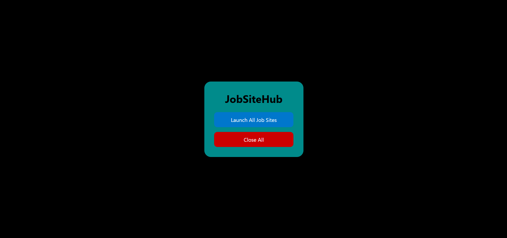

# 🚀 JobSiteHub

**JobSiteHub** is a productivity web app that allows job seekers to open multiple Indian job portals with a single click and optionally close them all together. It helps streamline the job application process by launching all relevant job websites simultaneously in new tabs—without switching focus.

---

## ✨ Features

- 🔘 One-click launch of major Indian job portals (LinkedIn, Naukri, Indeed, Monster, etc.)
- ❌ Close all opened tabs with one click
- 🧭 Keeps the current tab focused (no auto-switch)
- 💡 Simple UI with responsive layout

---

## 📸 Screenshot

 <!-- Replace with your actual screenshot -->

---

## 🌐 Supported Job Portals

- [LinkedIn India](https://in.linkedin.com/)
- [Naukri](https://www.naukri.com/)
- [Indeed India](https://www.indeed.co.in/)
- [Monster India](https://www.monsterindia.com/)
<!-- Add more if you expand -->

---

## 🛠️ How It Works

1. Click **"Launch All Job Sites"** – all portals open in new tabs.
2. Stay on the same page (tabs open in background).
3. Click **"Close All"** to close all opened tabs (same session only).

---

## 🧾 Technologies Used

- HTML5
- CSS3
- JavaScript (Vanilla)

---

## 📁 File Structure

```
/JobSiteHub
│
├── index.html # Main HTML structure
├── style.css # Styling for the app
├── script.js # JavaScript logic for opening/closing tabs
└── README.md # Project documentation
```

---

## 🚧 Limitations

- Tabs must be opened by the app to be closed programmatically.
- Popup blockers must be disabled or permission given to open tabs.

---

## 📌 License

This project is open-source and free to use for educational and personal productivity purposes.

---

## 🙌 Author

**Niloy Sarkar**
🌐 [LinkedIn](https://www.linkedin.com/in/niloy-sarkar/) | 💻 [GitHub](https://github.com/your-github)

---

```

```
